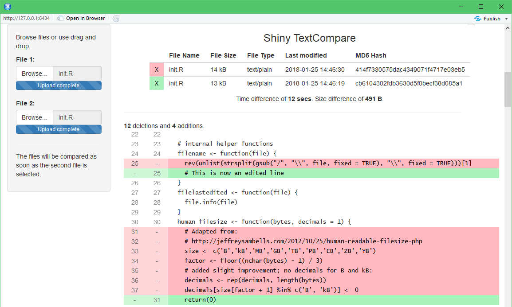
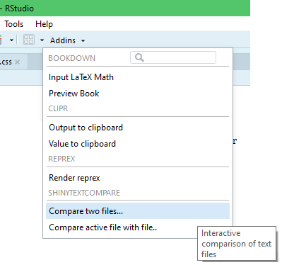
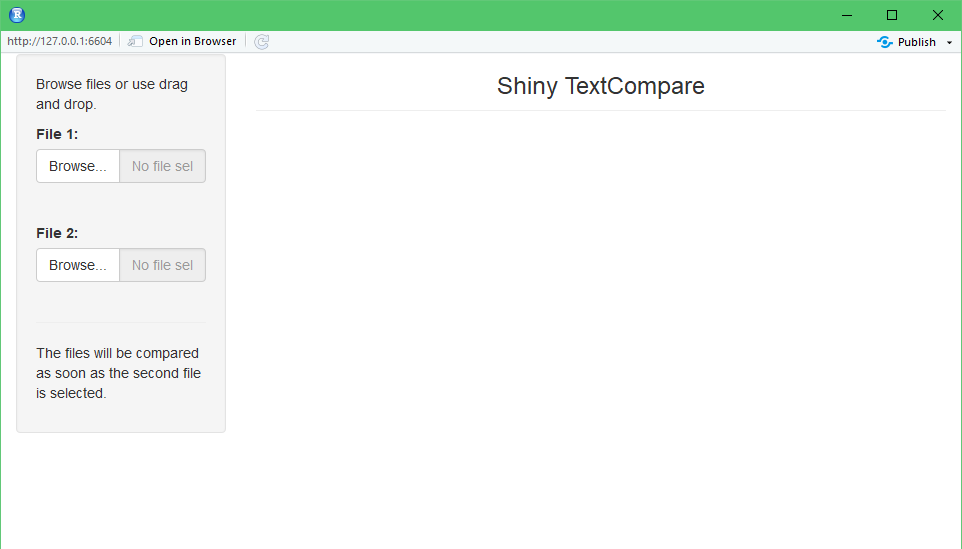
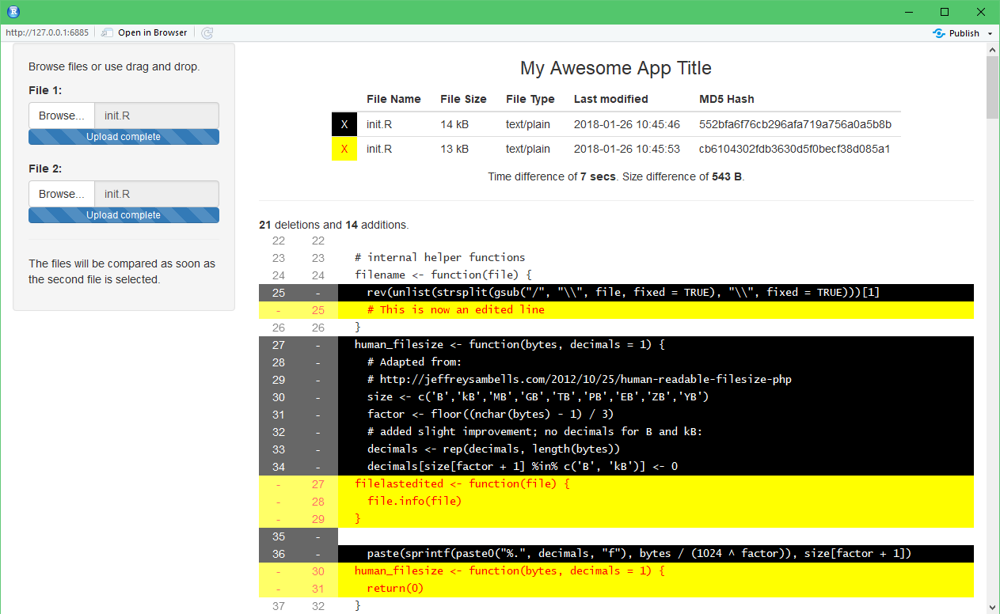

# `shinyTextCompare`
Compare text files with each other, just like the revision pages of GitHub.




## Using RStudio Addins
In RStudio, you can press the button **Addins** to open this Shiny app:



The same window as above will appear. With the function `Compare active file with file...` the file that is opened in the Source Editor will be used as the first file. A popup screen will appear to select a second file. This is the fastest way to compare the current file with e.g. older versions.


## Using the Console
```r
library(shinyTextCompare)
textcompare()
```
Now a new window appears. Just drag your files to the app and they will be compared line by line.




```r
# Without upload, defining both files directly:
textcompare("file1.txt", "file2.txt")
```

### Theming

```r
# Set specific colours to the app, must be CSS valid:
textcompare(file1_backgroundcolor = "black",
            file1_foregroundcolor = "white",
            file2_backgroundcolor = "yellow",
            file2_foregroundcolor = "red",
            title = "My Awesome App Title")
```

